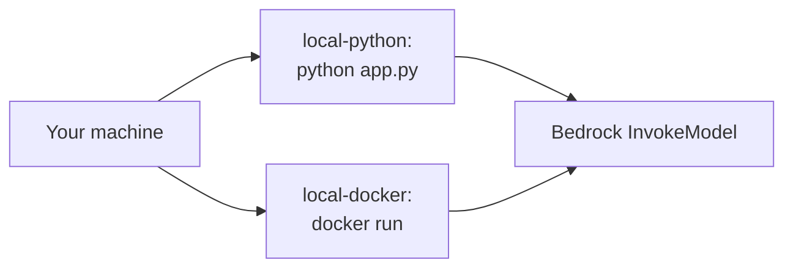

# 00-local-dev

## At a glance

| | |
|---|---|
| **AWS services** | Bedrock (`InvokeModel` only) — no deploy infrastructure at all |
| **Tool** | Plain Python and Docker, no IaC |
| **Status** | ✅ Working end to end (both submethods) |
| **Real errors hit & fixed** | 0 — this is the baseline; the point is ruling out agent-code and Dockerfile problems before any deploy mechanism gets layered on top |
| **What's different here** | The only module with zero AWS resources to create or tear down |

The baseline. Same calculator agent (Strands Agents, `bedrock:InvokeModel`, one `calculator`
tool) used everywhere else in this repo, run two ways with zero AWS deploy target involved:
`local-python` (plain `python`, no Docker) and `local-docker` (the same Dockerfile shape reused
starting in `04-lambda`/`06-ecs-fargate`/`07-app-runner`).



The point isn't the agent logic -- it's proving both "does the code run at all" and "does the
container build and run correctly" *before* any of `01`-`09` add a deploy mechanism on top. If
something's broken here, it's broken everywhere downstream too; ruling that out first makes every
later module's debugging faster.

**Important:** even running locally, this still makes a real Bedrock API call. There's no offline
mode. You need working AWS credentials (any profile with `bedrock:InvokeModel` on the model
listed below) and the model enabled in `us-east-1`.

## Files
- `local-python/app.py` / `requirements.txt` / `invoke_local_agent.py` -- run directly with
  `python`, no container
- `local-docker/app.py` / `requirements.txt` / `Dockerfile` / `invoke_local_agent.py` -- same
  agent, packaged into a container and run with `docker run`

## local-python: how to run

```bash
cd 00-local-dev/local-python
python -m venv venv
venv\Scripts\activate          # Windows; use `source venv/bin/activate` on macOS/Linux
pip install -r requirements.txt
python app.py
```

In another terminal:
```bash
cd 00-local-dev/local-python
python invoke_local_agent.py "What is 25 * 4?"
```

Or with curl:
```bash
curl -X POST http://localhost:8080/invoke -H "Content-Type: application/json" -d "{\"prompt\": \"What is 25 * 4?\"}"
```

## local-docker: how to run

```bash
cd 00-local-dev/local-docker
docker build -t calc-agent-local .
```

AWS credentials need to get into the container somehow -- easiest is mounting your existing
`~/.aws` folder read-only rather than passing raw keys as env vars:

```bash
docker run -p 8080:8080 -v %USERPROFILE%\.aws:/root/.aws:ro -e AWS_DEFAULT_REGION=us-east-1 calc-agent-local
```

(macOS/Linux: `-v ~/.aws:/root/.aws:ro`)

In another terminal:
```bash
cd 00-local-dev/local-docker
python invoke_local_agent.py "What is 25 * 4?"
```

To stop: `Ctrl+C` in the terminal running `docker run`, or `docker ps` + `docker stop <container_id>`.

## Notes / gotchas
- No `AWS::` resources created anywhere -- nothing to tear down, nothing billed except the
  handful of Bedrock tokens per invoke.
- `local-docker`'s Dockerfile is intentionally the same shape (`python:3.11-slim`, port 8080,
  `uvicorn` CMD) as every later containerized module, so this doubles as the first sanity check
  for that Dockerfile pattern before it's reused.
- If `docker run` starts but `/health` never responds, check the container logs
  (`docker logs <container_id>`) before assuming an AWS credentials problem -- a missing
  `~/.aws` mount usually shows up as a Bedrock `NoCredentialsError` in the logs, not a connection
  failure from `invoke_local_agent.py`.

## Status
- [x] local-python: run and invoke confirmed working
- [x] local-docker: build, run, and invoke confirmed working
