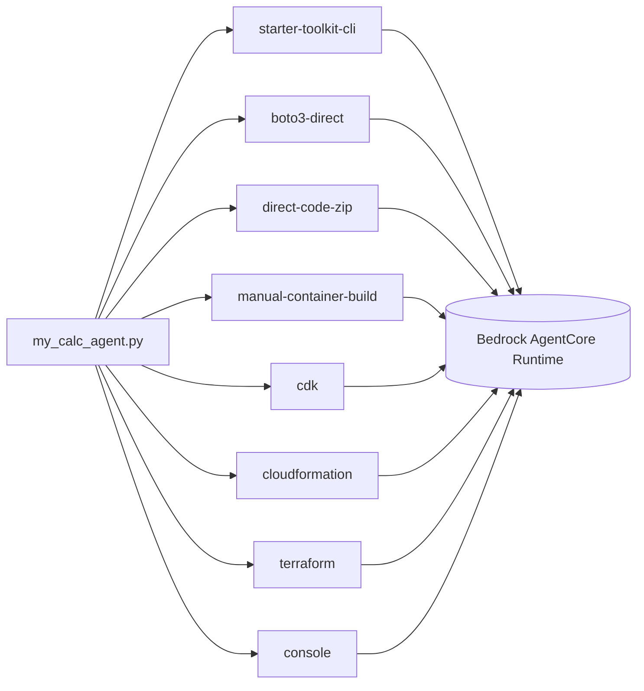

# 01 - AgentCore Runtime (multiple deployment mechanisms, same target)

## At a glance

| | |
|---|---|
| **AWS services** | Bedrock AgentCore Runtime (plus ECR/CodeBuild for the container-based methods) |
| **Tool** | All 8: CLI, boto3, code-zip, manual Docker, CDK, CloudFormation, Terraform, Console |
| **Status** | ✅ All 8 methods deployed and invoked successfully |
| **Real errors hit & fixed** | 9+ distinct gotchas (see below) — `console/` alone surfaced 4 new IAM gaps, more than any other single method |
| **What's different here** | The deepest single-target comparison in the repo — one AWS resource, every major way AWS lets you create it |

All subfolders here deploy the exact same calculator agent to the exact same target —
Amazon Bedrock AgentCore Runtime — using different tools. The point is to compare deployment
mechanics directly, not to build different agents.



## Subfolders

| Folder | Status | What it shows |
|---|---|---|
| `starter-toolkit-cli/` | Done (deployed, invoked) | Python starter toolkit (`agentcore configure`/`launch`) — deprecated by AWS, but the original working path, worth documenting for the tooling-shift story |
| `boto3-direct/` | Done (deployed, invoked) | Programmatic deploy/invoke via `bedrock_agentcore_starter_toolkit` SDK + raw `invoke_agent_runtime` boto3 call — no CLI at all |
| `direct-code-zip/` | Done (deployed, invoked) | Zip-upload deploy path (`CodeConfiguration`), no Docker/ECR at all — raw boto3, no toolkit |
| `manual-container-build/` | Done (deployed, invoked) | Own `Dockerfile`, manual `docker build`/push to ECR, then raw `create_agent_runtime` pointed at that image — no CodeBuild automation |
| `cdk/` | Done (deployed, invoked) | Hand-written Python CDK (not auto-generated by a CLI) using `aws_cdk.aws_bedrockagentcore.Runtime` |
| `cloudformation/` | Done (deployed, invoked) | Raw, hand-authored YAML template — the exact resource shape `cdk synth` produces, written directly |
| `terraform/` | Done (deployed, invoked) | `hashicorp/aws`'s native `aws_bedrockagentcore_agent_runtime` resource — separate engine/state from the CloudFormation-based methods |
| `console/` | Done (deployed, invoked) | Pure AWS Management Console click-through, no code/CLI/IaC at all |
| `scripts/` | Done | Reusable management utilities: `list_agents.py`, `delete_agent.py` — not a deployment method, just tooling used across this whole module |

(The new npm-based `agentcore` CLI, which also deploys here via auto-generated CDK, lives in
the separate top-level `02-agentcore-cli/` folder, not nested under here, since it's a
different generation of tooling worth comparing side by side rather than nesting.)

## Note on duplication
`my_calc_agent.py` + `requirements.txt` are intentionally copied into every sub-method folder.
Same agent code everywhere, on purpose — each folder needs to be runnable standalone without
reaching into a sibling folder, and duplication makes that possible at the cost of needing to
update the file in more than one place if the agent logic ever changes.

## How to rerun / verify what's already deployed
Each sub-method folder has its own README with the exact rerun commands. Quick pointers:

```bash
cd starter-toolkit-cli && agentcore status
cd boto3-direct && python invoke_agent.py
cd direct-code-zip && python invoke_code_zip_agent.py <ID> "What is 25 * 4?"
cd manual-container-build && python invoke_container_agent.py <ID> "What is 25 * 4?"
cd cdk && python invoke_cdk_agent.py <ID> "What is 25 * 4?"
cd cloudformation && python invoke_cfn_agent.py <ID> "What is 25 * 4?"
cd terraform && python invoke_tf_agent.py <ID> "What is 25 * 4?"
```

Use `scripts/list_agents.py` to see every deployed runtime ID at once across all methods.

## Status
- [x] `starter-toolkit-cli` — deployed and invoked successfully
- [x] `boto3-direct` — deployed and invoked successfully
- [x] `direct-code-zip` — deployed and invoked successfully
- [x] `manual-container-build` — deployed and invoked successfully
- [x] `cdk` — deployed and invoked successfully
- [x] `cloudformation` — deployed and invoked successfully
- [x] `terraform` — deployed and invoked successfully
- [x] `console` — deployed and invoked successfully (4 new IAM gaps hit — most of any single method)
- [x] `scripts` — `list_agents.py`/`delete_agent.py` used throughout

## Notes / gotchas (running list across every sub-method)
- Old Claude 3.5 Haiku model ID went Legacy/EOL on Bedrock — switched to
  `us.anthropic.claude-haiku-4-5-20251001-v1:0`.
- One-time Anthropic "use case details" form required per AWS account before first invoke.
- `AccessDeniedException` on first invoke: needed `aws-marketplace:Subscribe`/`ViewSubscriptions`
  permissions (Bedrock auto-subscribes third-party models via Marketplace on first use).
- IAM inline policies have a 2048 non-whitespace character limit — use customer-managed
  policies (6144 char limit) once you hit it.
- Windows `cmd.exe` doesn't support bash's `\` line continuation or single-quoted strings — any
  copied CLI example needs flattening to one line with escaped double quotes. `<` and `>` are
  redirection operators even outside code — never type a placeholder like `<VALUE>` literally.
- Building arm64 images on x86 Windows goes through QEMU emulation — if pip/uv falls back to
  compiling anything from source, it can hang 30+ minutes. Fix: pre-fetch wheels on the host with
  `uv --only-binary=:all: --target vendor`, then `COPY vendor/` in the Dockerfile — never run
  `pip install` inside the emulated container.
- `bedrock_agentcore` SDK's server binds `127.0.0.1` unless `DOCKER_CONTAINER=1` is set —
  container looks healthy, every external request just gets an empty reply, no error logged.
- Each new tool (CLI, boto3, CDK, CloudFormation, Terraform) triggers its own distinct IAM
  permission gap for the exact same underlying AWS action, because each client makes different
  background read/describe calls. Always fix by running the real command and reading the exact
  `AccessDenied` message — never pre-grant broadly.
- Explicit `RoleName`/`agent_runtime_name` values matching the already-granted `*BedrockAgentCore*`
  IAM pattern avoid a predictable second AccessDenied right after fixing the first, in any
  IaC tool that would otherwise auto-generate a resource name.
