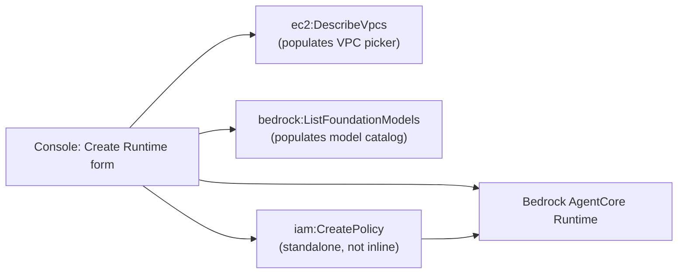

# console

## At a glance

| | |
|---|---|
| **AWS services** | Bedrock AgentCore Runtime, EC2 (read-only, for a VPC picker), IAM |
| **Tool** | Pure AWS Management Console click-through — no code, CLI, or IaC at all |
| **Status** | ✅ Working end to end |
| **Real errors hit & fixed** | 4 IAM gaps — more than any single CLI or IaC method in this repo |
| **What's different here** | The console builds the execution role's permissions as a *standalone* customer-managed policy (`iam:CreatePolicy`), not the inline policy every scripted/IaC method used — a genuinely different governance model |

Deploys the calculator agent to AgentCore Runtime purely through the AWS Management Console --
no CLI, no script, no IaC template. Reused the container image already pushed in
`manual-container-build` (`bedrock-agentcore-calc-agent-manual:latest`) rather than building a
fresh one -- the point of this module is the click-through experience itself, not another proof
that the Docker/ECR pipeline works, which has already been demonstrated four times over.

## Files
- `invoke_console_agent.py` -- same invoke pattern as every other module, for testing from a
  terminal in addition to the console's own built-in test panel.

## How to redo end to end

1. Sign in to the AWS Console as `always_learner` (not root -- deliberately, to see what
   permission gaps the console surfaces that scripted/IaC methods never hit).
2. Search "AgentCore" in the top console search bar → **Amazon Bedrock AgentCore**.
3. Left nav → **Runtime** → **Create**.
4. Fill in:
   - Runtime name: `calc_agent_console`
   - Artifact type: **ECR** (the other console option is **S3**, matching `codeConfiguration`
     vs `containerConfiguration` from every other module -- same two artifact types, same
     underlying API, just a radio button in the UI instead of a boto3 parameter)
   - Image URI: `486517829337.dkr.ecr.us-east-1.amazonaws.com/bedrock-agentcore-calc-agent-manual:latest`
   - Execution role: **Create new** (see IAM section below for what this actually does
     differently from every other method)
   - Network mode: Public
5. Create, wait for it to finish provisioning.
6. Test directly in the console's own test panel (chat box on the Runtime detail page), or via
   `python invoke_console_agent.py <AGENT_RUNTIME_ID> "What is 25 * 4?"`.

## What's different from every other method

The console is the only method tonight that required **four separate new IAM grants**, more
than any single CLI/IaC tool -- because a UI has to proactively populate dropdowns and helper
sections for options you might click, not just execute the one action you actually asked for.
Every other method only ever asked for exactly what it needed to complete your specific request.

The console also creates execution role permissions completely differently from every other
method: it generates a **standalone customer-managed IAM policy**
(`AmazonBedrockAgentCoreRuntimeExecutionPolicy_<random-suffix>`) and attaches it to the role,
rather than embedding an inline policy the way our own boto3 scripts, CDK's L2 construct, our
hand-written CloudFormation, and Terraform's `aws_iam_role_policy` all did. Different IAM action
entirely (`iam:CreatePolicy` vs `iam:PutRolePolicy`), and a genuinely different governance model
-- a standalone policy can be reused/audited/versioned independently of the role, which an inline
policy can't.

## IAM permissions

Four new gaps, all fixed via CloudShell as root, same pattern as every other module -- this
module alone accounts for a third of every IAM fix made across the whole `01-agentcore-runtime`
build:

1. **`ec2:DescribeVpcs`** -- the Create form's network configuration section calls this to
   populate a VPC picker, even when heading toward Public mode. Fixed with
   `AgentCoreConsoleEc2ReadAccess` (`DescribeVpcs`/`DescribeSubnets`/`DescribeSecurityGroups`,
   `Resource: "*"` since EC2 `Describe*` actions don't support resource-level ARN scoping at all).
2. **`bedrock:ListInferenceProfiles`** and **`bedrock:ListFoundationModels`** -- a model-related
   helper section reads the available model catalog. Fixed with
   `AgentCoreConsoleBedrockReadAccess`, `ListFoundationModels` needing `Resource: "*"` since it
   enumerates AWS's public model catalog, not anything account-owned.
3. **`iam:CreatePolicy`** on a policy named `AmazonBedrockAgentCoreRuntimeExecutionPolicy_*` --
   the console's different execution-role creation model, described above. Fixed with
   `AgentCoreConsoleIamPolicyMgmt`, scoped to `arn:aws:iam::486517829337:policy/*BedrockAgentCore*`
   (same naming-pattern-matching approach used for every role grant, extended to the separate
   `policy/` ARN namespace).

## Status
- [x] Runtime created successfully via pure console click-through
- [x] All 4 new IAM gaps hit and fixed
- [x] Tested via the console's own built-in test panel -- confirmed working
- [x] `invoke_console_agent.py` written for terminal-based retesting

## Notes / gotchas
- The console surfaces more distinct permission gaps than any single CLI or IaC tool, precisely
  because it has to support every possible path through the form, not just the one you're
  actually taking -- a good, concrete talking point on why narrow IAM users find real gaps that
  broad-permission testing never would.
- Runtime name is `calc_agent_console` -- check `list_agents.py` alongside every other deployed
  agent from this project.
