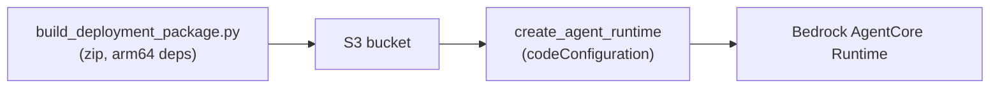

# direct-code-zip

## At a glance

| | |
|---|---|
| **AWS services** | Bedrock AgentCore Runtime, S3, IAM — no ECR, no CodeBuild |
| **Tool** | Raw boto3, `codeConfiguration` (zip upload), no container at all |
| **Status** | ✅ Working end to end |
| **Real errors hit & fixed** | 0 — existing `BedrockAgentCoreFullAccess`/`BedrockAgentCoreCLIAccess` grants already covered it, confirmed by reasoning through the naming patterns before running anything |
| **What's different here** | No Docker, no ECR, no CodeBuild — same mental model as a plain Lambda zip deploy; AWS manages the Python runtime, you own the code and arm64-compatible dependencies |

Deploys the same calculator agent to AgentCore Runtime with no Docker, no ECR, no CodeBuild --
just a zip file of code + dependencies, uploaded to S3, referenced directly by
`create_agent_runtime`. AWS added this deploy mode in Nov 2025; it's the same mental model as
a plain AWS Lambda zip deployment (AWS manages the Python runtime/OS patching, you own your
code and dependencies).

Key constraint: AgentCore Runtime only runs on **arm64**. Pure Python packages don't care, but
any dependency with compiled C code needs to be the Linux/arm64 build specifically, not
whatever your local machine would normally install.



## Files
- `my_calc_agent.py` — same agent code as the other sub-methods
- `requirements.txt` — trimmed to actual runtime dependencies only (dropped
  `bedrock-agentcore-starter-toolkit` from the original list -- that's a deploy-time tool, not
  something the running agent imports, so it doesn't belong in the deployment package)
- `build_deployment_package.py` — installs deps for linux/arm64 via `uv`, zips everything with
  explicit Linux file permissions set (Windows doesn't set these by default, and AgentCore
  Runtime enforces them)
- `deploy_code_zip.py` — boto3: creates S3 bucket + IAM execution role if needed, uploads the
  zip, calls `create_agent_runtime` (or `update_agent_runtime` if already deployed)
- `invoke_code_zip_agent.py` — boto3 test invocation

## How to run

```bash
cd 01-agentcore-runtime/direct-code-zip
python build_deployment_package.py
python deploy_code_zip.py
python invoke_code_zip_agent.py AGENT_RUNTIME_ID "What is 25 * 4?"
```
(`deploy_code_zip.py` prints the exact `AGENT_RUNTIME_ID` to use at the end.)

Safe to rerun any of the three scripts -- each one skips/updates existing resources rather than
failing on them.

## IAM permissions
Not requesting a new policy for this one -- reasoning through what's already granted
(`BedrockAgentCoreFullAccess` + `BedrockAgentCoreCLIAccess` from earlier modules) against what
this needs:
- S3 bucket/object access: covered as long as the bucket name starts with `bedrock-agentcore-`
  (matches the existing wildcard-scoped S3 statement) -- used `bedrock-agentcore-code-{account}-{region}`.
- IAM role create/manage: covered as long as the role name contains `BedrockAgentCore` -- used
  `BedrockAgentCoreDirectZipExecutionRole`.
- `iam:PassRole` to the new execution role: covered by `BedrockAgentCoreFullAccess`'s
  `BedrockAgentCorePassRoleAccess` statement (matches role name pattern + service condition).
- `create_agent_runtime`/`update_agent_runtime`: covered by `BedrockAgentCoreFullAccess`'s
  blanket `bedrock-agentcore:*` grant.

If this turns out wrong once actually run, fix it the same way as every other module: run the
failing command, read the exact `AccessDenied` message, grant precisely that.

## Status
- [x] `build_deployment_package.py` written and run
- [x] `deploy_code_zip.py` written and run
- [x] `invoke_code_zip_agent.py` written and run — confirmed working end to end
- [x] No new IAM policy was needed — existing `BedrockAgentCoreFullAccess` /
      `BedrockAgentCoreCLIAccess` grants covered the S3 bucket, IAM role, and
      create_agent_runtime calls, confirming the naming-pattern reasoning above.

## Notes / gotchas
- Runtime name is `calc_agent_direct_zip` — check for it with `list_agents.py` alongside your
  other deployed agents to avoid losing track of which is which.
- `lifecycleConfiguration` sets `idleRuntimeSessionTimeout: 300` (5 min) and `maxLifetime: 1800`
  (30 min) — after 5 min idle, the next invoke will cold-start again (slower first response).
- This is a genuinely separate deploy path from `boto3-direct/`: that folder calls the starter
  toolkit's `.configure()`/`.launch()` Python API, which still builds and pushes a container
  under the hood. This folder calls `create_agent_runtime` directly with `codeConfiguration`,
  no container involved at all.
