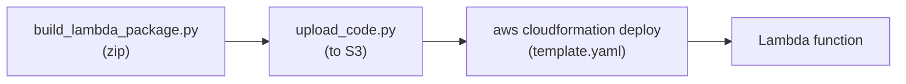

# 04-lambda / cloudformation

## At a glance

| | |
|---|---|
| **AWS services** | Lambda, IAM, S3 (reuses the bucket `direct-code-zip` already created) |
| **Tool** | Raw, hand-authored CloudFormation YAML |
| **Status** | ✅ Working end to end |
| **Real errors hit & fixed** | 1 gap — a stack-naming case mismatch (`calc-agent-lambda-cfn` vs. the granted `CalcAgent*` pattern), fixed by renaming the stack, not by touching IAM |
| **What's different here** | CloudFormation can't package or upload the zip itself — needs an extra manual `upload_code.py` step to S3 before deploy, unlike CDK or Terraform which handle the artifact directly |

Same calculator agent, deployed via raw hand-written `AWS::Lambda::Function` CloudFormation --
no CDK abstraction, no Terraform HCL, just the native template + `aws cloudformation deploy`.



## How this differs from cdk/ and terraform/

CloudFormation cannot build or package anything -- same lesson already learned in
`01-agentcore-runtime/cloudformation` with the Docker image. There, the container had to be
built and pushed to ECR *before* the template ran, because CloudFormation can only reference an
artifact that already exists. Here it's the same shape with a different artifact type: the zip
has to be built and uploaded to S3 *before* `aws cloudformation deploy` runs, because
`AWS::Lambda::Function` only accepts a `Code.S3Bucket`/`Code.S3Key` pointer (or a tiny inline
`ZipFile` string with no room for real dependencies) -- it can't pull from a local path the way
`cdk.Code.from_asset()` or Terraform's `filename`/`source_code_hash` can.

So this module needs one extra step the other two don't: `upload_code.py`, which reuses the
S3 bucket `01-agentcore-runtime/direct-code-zip` already created
(`bedrock-agentcore-code-{account}-{region}`) under a new key prefix, rather than provisioning a
second bucket -- since the existing IAM policy's S3 access is already scoped to the
`bedrock-agentcore-*` bucket-name pattern, reusing it meant zero new permission gaps for this
module.

## Files
- `lambda_function.py` / `requirements.txt` -- same handler code as every other Lambda module
- `build_lambda_package.py` -- same x86_64 `uv --only-binary=:all:` zip-build approach
- `upload_code.py` -- uploads the built zip to S3 (the step CloudFormation itself can't do)
- `template.yaml` -- raw `AWS::IAM::Role` + `AWS::IAM::Policy` + `AWS::Lambda::Function`
- `invoke_lambda_agent.py` -- same `lambda.invoke()` pattern as every other Lambda module

## How to run end to end

```bash
cd 04-lambda/cloudformation
python build_lambda_package.py
python upload_code.py
# copy the CodeS3Bucket value it prints, then:
aws cloudformation deploy \
  --template-file template.yaml \
  --stack-name CalcAgentLambdaCfnStack \
  --parameter-overrides CodeS3Bucket=<bucket-name-from-upload_code.py> \
  --capabilities CAPABILITY_NAMED_IAM
python invoke_lambda_agent.py "What is 25 * 4?"
```

## IAM permissions

One gap hit, and it was the *stack name* that tripped it, not a missing action. The account
already has `AgentCoreCloudFormationDeployAccess` (created back in
`01-agentcore-runtime/cloudformation`), scoped to
`arn:aws:cloudformation:us-east-1:486517829337:stack/CalcAgent*/*`. Deploying with
`--stack-name calc-agent-lambda-cfn` (kebab-case, matching the Lambda-world naming convention)
didn't match that `CalcAgent*` wildcard -- IAM ARN matching is case-sensitive and pattern-literal,
so `calc-agent-lambda-cfn` != `CalcAgent...`. Result: `cloudformation:DescribeStacks` AccessDenied
before the stack was ever created (`aws cloudformation deploy` checks for an existing stack via
`DescribeStacks` up front, so nothing gets created at all when this call is denied).

**Fixed by renaming the stack, not by touching IAM** -- `--stack-name CalcAgentLambdaCfnStack`
matches the already-granted pattern exactly, so this module needed zero new policies or policy
versions. Given the account was already at/near the 10-managed-policy ceiling hit in
`terraform/`, "does this name already fit a grant I have" is now the first move before any IAM
change, not just a nice-to-have.

The role name (`CalcAgentLambdaCfnExecutionRole`) and function name (`calc_agent_lambda_cfn`)
were both chosen the same way, to match `role/CalcAgentLambda*` (module 03) and
`function:calc_agent_*` (`AgentCoreLambdaComputeTargetAccess`) respectively -- only the
*CloudFormation stack name* itself was overlooked on the first pass.

## Status
- [x] Deployed and invoked successfully
- [x] One naming-driven IAM gap hit and fixed by renaming the stack, no new policy needed

## Notes / gotchas
- `CAPABILITY_NAMED_IAM` is required because the template creates an IAM role with an explicit
  `RoleName` rather than letting CloudFormation auto-generate one.
- Unlike `terraform apply`, `aws cloudformation deploy` is idempotent by default and safe to
  rerun -- it no-ops with "No changes to deploy" if nothing changed.
- To tear down: `aws cloudformation delete-stack --stack-name CalcAgentLambdaCfnStack` (the S3
  object and bucket are untouched since they're outside the stack -- shared with
  `direct-code-zip`).
