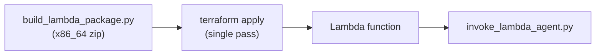

# 04-lambda / terraform

## At a glance

| | |
|---|---|
| **AWS services** | Lambda, IAM |
| **Tool** | Terraform, `hashicorp/aws`'s native `aws_lambda_function` resource |
| **Status** | ✅ Working end to end |
| **Real errors hit & fixed** | 2 gaps — a `GetFunctionCodeSigningConfig` read-back permission, and the first hit anywhere in this project of AWS's 10-managed-policy-per-user quota |
| **What's different here** | No ECR chicken-and-egg problem like `01-agentcore-runtime/terraform` — a zip deployment just needs a local file, so one `terraform apply` does everything. Also the point where the "new policy per gap" habit stopped scaling and switched to policy *versioning* |

Same calculator agent, deployed via `hashicorp/aws`'s native `aws_lambda_function` resource.
Much simpler than `01-agentcore-runtime/terraform`: no ECR chicken-and-egg problem, since a
Lambda zip deployment just needs a local file, not a container registry Terraform has to create
first -- a single `terraform apply` gets everything done, not two.



## Files
- `lambda_function.py` / `requirements.txt` -- same handler code as `zip-deploy` and `cdk`
- `build_lambda_package.py` -- same x86_64 `uv --only-binary=:all:` zip-build approach
- `main.tf` / `variables.tf` / `outputs.tf` -- IAM role/policy (via `aws_iam_policy_document`)
  + the function itself, pointing `filename`/`source_code_hash` directly at the built zip
- `invoke_lambda_agent.py` -- same `lambda.invoke()` pattern as every other Lambda module

## How to run end to end

```bash
cd 04-lambda/terraform
python build_lambda_package.py
terraform init
terraform apply
python invoke_lambda_agent.py "What is 25 * 4?"
```

## IAM permissions -- the interesting one this time

Two gaps, and the second one is a genuinely different lesson than anything hit so far tonight:

1. **`lambda:GetFunctionCodeSigningConfig`** -- same "post-create read-back" pattern as ECR:
   the function was created successfully, then Terraform's provider read back extra config for
   state consistency and hit a permission gap on that follow-up call. Bundled a few likely-
   related read actions together (`GetFunctionConcurrency`, `GetFunctionEventInvokeConfig`,
   `GetPolicy`, `ListTags`) rather than discovering each one separately.
2. **`LimitExceeded: Cannot exceed quota for PoliciesPerUser: 10`** -- AWS's default hard cap
   on managed policies attached to a single IAM user, hit exactly at the 10th policy after a
   whole night of one-policy-per-gap fixes. Real lesson: that pattern doesn't scale forever.
   Fixed by **extending an already-attached policy with a new version**
   (`aws iam create-policy-version --set-as-default`) instead of creating an 11th standalone
   policy -- versioning an existing policy doesn't count against the attachment quota at all.
   Also hit a short IAM propagation delay after the version update (same class of delay as the
   `time.sleep(10)` after every role creation) -- confirmed the new version was actually set as
   default (`aws iam get-policy --query Policy.DefaultVersionId`) before concluding it was just
   propagation lag, not a failed update.

## Status
- [x] Deployed and invoked successfully
- [x] Hit and fixed the 10-managed-policy-per-user quota -- a first for this project

## Notes / gotchas
- **This is the point where the "one narrow policy per gap" pattern stopped scaling.** Every
  fix from `01-agentcore-runtime` onward created a brand-new customer-managed policy, and by
  this module the account had exactly 9 customer-managed policies + 1 AWS-managed one attached
  to `always_learner` -- hitting AWS's default ceiling. Going forward, extend an existing
  related policy with a new version rather than creating a new one, where the scope genuinely
  fits (e.g. all Lambda-related read/write actions belong in one policy, not scattered across
  several). Policy versions cap at 5 per policy too -- worth pruning old non-default versions
  if this project keeps growing.
