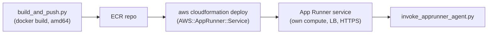

# 07-app-runner / cloudformation

## At a glance

| | |
|---|---|
| **AWS services** | App Runner, ECR, IAM (AccessRole + InstanceRole) |
| **Tool** | Raw, hand-authored CloudFormation YAML |
| **Status** | ✅ Working end to end |
| **Real errors hit & fixed** | 2 IAM gaps — `apprunner:CreateService` AccessDenied, and `iam:CreateServiceLinkedRole` on the account's first-ever App Runner service |
| **What's different here** | The simplest compute target in the repo by a wide margin — one resource (`AWS::AppRunner::Service`) replaces ECS's cluster, task definition, service, ALB, target group, and security groups entirely, with built-in HTTPS and no VPC/NAT Gateway to manage |

The calculator agent on AWS App Runner -- the simplest compute target in this repo by a wide
margin. Single method (raw CloudFormation) per the pacing decision.



## How this differs from everything before it

`06-ecs-fargate` needed a cluster, task definition, service, ALB, target group, listener, and
two security groups -- six-plus distinct resource types just to get a container reachable, plus
CDK silently created an entire new VPC with two NAT Gateways along the way. App Runner collapses
almost all of that into **one resource**: `AWS::AppRunner::Service`. No VPC, no NAT Gateway, no
ALB, no security groups to define (unless you explicitly want private VPC connectivity, which
this module doesn't). App Runner provisions its own compute, its own load balancer, its own
public HTTPS endpoint (TLS included, unlike the plain-HTTP ALB in `06`), and its own health
checks and scaling policy, all as one managed resource.

The two-role split still exists, but with different names than ECS: an **AccessRole** (used by
App Runner's build/deploy machinery to pull the image from ECR -- equivalent to ECS's execution
role) and an **InstanceRole** (used by the running container's own AWS SDK calls, i.e.
`bedrock:InvokeModel` -- equivalent to ECS's task role).

## Files
- `container/app.py` / `container/requirements.txt` / `container/Dockerfile` -- the agent,
  packaged as a container (same FastAPI wrapper shape as `05-ec2` and `06-ecs-fargate`)
- `build_and_push.py` -- creates the ECR repo, builds the image (linux/amd64), pushes it.
  CloudFormation can't build images, same lesson as `01-agentcore-runtime/cloudformation` and
  `04-lambda/cloudformation`
- `template.yaml` -- `AccessRole` + `InstanceRole` + `AWS::AppRunner::Service`
- `invoke_apprunner_agent.py` -- stdlib-only HTTPS client hitting the service's `/invoke`

## How to run end to end

```bash
cd 07-app-runner/cloudformation
python build_and_push.py
# copy the printed image URI, then:
aws cloudformation deploy \
  --template-file template.yaml \
  --stack-name CalcAgentAppRunnerStack \
  --parameter-overrides ImageIdentifier=<image-uri-from-build_and_push.py> \
  --capabilities CAPABILITY_NAMED_IAM
aws cloudformation describe-stacks --stack-name CalcAgentAppRunnerStack --query "Stacks[0].Outputs" --output table
python invoke_apprunner_agent.py <SERVICE_URL> "What is 25 * 4?"
```

To tear down: `aws cloudformation delete-stack --stack-name CalcAgentAppRunnerStack`.

## IAM permissions

Two distinct gaps hit, both fixed by extending `AgentCoreCloudFormationDeployAccess` via
`aws iam create-policy-version --set-as-default` (same pattern as every prior module -- one
policy per gap would hit the 10-managed-policy account cap fast):

1. **`apprunner:CreateService` AccessDenied.** CloudFormation runs `AWS::AppRunner::Service`
   creation under the deploying principal's own credentials (`always_learner`), not a bootstrap
   or service role -- so `always_learner` needed direct `apprunner:*` grants (CreateService,
   DescribeService, DeleteService, UpdateService, ListServices, ListOperations, TagResource,
   ListTagsForResource), scoped `Resource: "*"` since App Runner service ARNs aren't known ahead
   of creation. First stack attempt rolled back cleanly (`ROLLBACK_COMPLETE`, no orphaned
   resources) after this was hit.
2. **`iam:CreateServiceLinkedRole` AccessDenied**, surfaced only after fix #1 -- this was the
   *first* App Runner service ever created in this AWS account, and App Runner needs to create
   its own service-linked role (`AWSServiceRoleForAppRunner`) the first time, which itself
   requires the caller to hold `iam:CreateServiceLinkedRole`. A one-time bootstrap permission,
   scoped tightly to the specific service-linked role ARN with an `iam:AWSServiceName` condition
   so it can't be used to create service-linked roles for other AWS services.

Lesson: `ROLLBACK_COMPLETE` stacks cannot be updated in place -- `aws cloudformation deploy`
against one fails with a `ValidationError` regardless of whether the underlying IAM gap is fixed.
Always `delete-stack` + `wait stack-delete-complete` before retrying.

See `cfn-apprunner-policy-merged.json` in this folder for the exact merged policy document used.

## Notes / gotchas
- Stack name deliberately `CalcAgentAppRunnerStack`, matching the `stack/CalcAgent*/*` pattern
  already granted to `always_learner` via `AgentCoreCloudFormationDeployAccess` -- same lesson
  learned the hard way in `04-lambda/cloudformation`.
- Role names (`CalcAgentAppRunnerAccessRole`, `CalcAgentAppRunnerInstanceRole`) match the
  `role/CalcAgent*` wildcard broadened during `05-ec2` -- should need no new IAM role-creation
  grant.
- `AutoDeploymentsEnabled: false` -- deliberately not watching the ECR repo for new image
  pushes and redeploying automatically. Simpler and more predictable for a portfolio module;
  redeploy explicitly with a stack update when the image changes.
- Costs money continuously while running (App Runner bills per vCPU/memory-second the service is
  provisioned, similar to Fargate) but with no NAT Gateway or ALB line items -- meaningfully
  cheaper to leave running than `06-ecs-fargate` was. Still worth deleting the stack when done.

## Status
- [x] Image built and pushed
- [x] Stack deployed, service running
- [x] Invoke confirmed working end to end
- [x] IAM gaps documented above with real errors
