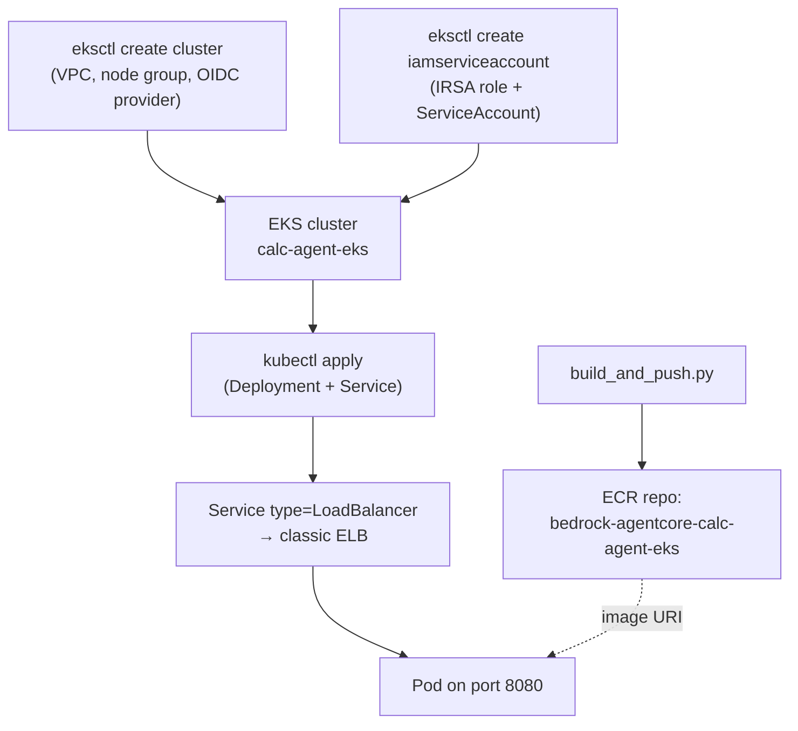

# 08-eks

## At a glance

| | |
|---|---|
| **AWS services** | EKS, ECR, IAM (IRSA), auto-created VPC/NAT Gateway |
| **Tool** | eksctl — a domain-specific CLI that generates and runs its own CloudFormation stacks |
| **Status** | ⏸ Paused mid-run — scaffolded but `eksctl create cluster` not yet completed |
| **Real errors hit & fixed** | 1 confirmed (`eks:DescribeClusterVersions` AccessDenied on eksctl's first read-only call) + 3 more anticipated and documented below, not yet hit |
| **What's different here** | Introduces IRSA — the only pod-scoped (not node-scoped) IAM credential pattern in the repo |

Kubernetes as the compute target: the same calculator agent, containerized the same way as
`06-ecs-fargate`, this time orchestrated by a real EKS cluster instead of ECS. Last of the
compute-target modules in the roadmap (Lambda, EC2, ECS Fargate, App Runner, EKS all covered),
built with **eksctl** — the purpose-built EKS CLI, a different IaC "flavor" than the
Terraform/CDK/CloudFormation already used elsewhere in this repo.

**Status: PAUSED, not run end to end.** Deprioritized after the first real run: eksctl's cluster
turnaround (15-20 min) plus its permission surface made this the slowest module to iterate on,
so it's parked in favor of higher-value portfolio items for now, with the option to come back.
One real gap was hit and fixed in the draft policy before pausing: `eks:DescribeClusterVersions`
AccessDenied on eksctl's very first (read-only) API call, missing from the original draft —
added to `iam/eks-cloudformation-additions-DRAFT.json`, but the `create-policy-version` merge
was never confirmed applied. Anyone picking this back up should start there.

## Why eksctl (not Terraform or CDK)

Terraform (`05-ec2`) and CDK (`06-ecs-fargate`) are already represented elsewhere in the repo.
eksctl is worth its own showcase because it's how most real EKS shops actually stand up a first
cluster — a single declarative YAML file (`cluster.yaml`) instead of hand-wiring a VPC, IAM
roles, an Auto Scaling group, and the control plane as separate resources. It's also a genuinely
different *kind* of tool than the other three: eksctl isn't a general-purpose IaC engine, it's a
domain-specific CLI that happens to generate and run its own CloudFormation stacks underneath —
worth knowing cold for an interview, since it means eksctl inherits CloudFormation's exact
"runs under the caller's own credentials" behavior already seen in `07-app-runner` and
`09-cicd-codepipeline`, just one layer removed from view.

## Architecture



## The IAM pattern unique to this module: IRSA

Every prior compute target used a different flavor of "how does the running code get AWS
credentials":
- Lambda: an execution role attached directly to the function
- EC2: an instance profile attached to the instance
- ECS Fargate: a task role, scoped per-task-definition
- App Runner: an instance role, similar to Lambda's

EKS's answer is **IRSA (IAM Roles for Service Accounts)**: a Kubernetes `ServiceAccount` object
gets annotated with an IAM role ARN, and that role's trust policy is scoped to trust *only that
exact ServiceAccount name + namespace*, via the cluster's own OIDC identity provider (created by
`iam.withOIDC: true` in `cluster.yaml`). A pod that sets `serviceAccountName: calc-agent-sa`
gets temporary credentials for that role injected automatically by the EKS Pod Identity webhook
— no code changes, no keys, and critically, **not** the node's own instance role, which every
pod scheduled on that node would otherwise share. This is the reason `cluster.yaml` explicitly
disables the node role's extra addon policies: Bedrock access belongs to the pod, not the node.

`eksctl create iamserviceaccount` does the trust-policy authoring for you (unlike hand-writing
the federated-principal JSON yourself) — worth remembering for an interview: IRSA's trust policy
shape is genuinely different from OIDC-federated GitHub Actions roles in `09-cicd-github-actions`
even though both are "trust an external OIDC provider," because the `sub` claim format and
audience are Kubernetes-specific (`system:serviceaccount:<namespace>:<name>`), not GitHub's.

## Files

- `container/` — `app.py`, `requirements.txt`, `Dockerfile`, byte-for-byte the same FastAPI
  wrapper shape as `06-ecs-fargate/cdk/container/`. The agent code never changes between compute
  targets, only how it's packaged and how it gets credentials.
- `build_and_push.py` — builds the image, pushes to its own ECR repo
  (`bedrock-agentcore-calc-agent-eks`), same pattern as every prior container module.
- `cluster.yaml` — eksctl `ClusterConfig`: cluster name/region/version, `iam.withOIDC: true`,
  one small managed node group (`t3.small`, 1 node, no SSH).
- `k8s/serviceaccount.yaml` — reference only, documents what
  `eksctl create iamserviceaccount --approve` generates automatically (don't `kubectl apply`
  this file directly — the role ARN placeholder isn't real until that command runs).
- `k8s/deployment.yaml` — the pod spec, referencing the IRSA-linked ServiceAccount and the ECR
  image (fill in `<ACCOUNT_ID>` after `build_and_push.py` prints it).
- `k8s/service.yaml` — `type: LoadBalancer`, provisions a classic ELB via EKS's built-in
  in-tree cloud provider (no separate AWS Load Balancer Controller add-on needed for this).
- `invoke_eks_agent.py` — stdlib HTTP POST test script against the ELB DNS name.
- `iam/eks-cloudformation-additions-DRAFT.json` — statements to add to the existing
  `AgentCoreCloudFormationDeployAccess` managed policy (not a new policy — `always_learner` is
  already at the 10-managed-policy attachment cap). Marked DRAFT deliberately: this is the
  largest, least-tested permission surface built so far, and real AccessDenied errors are
  expected on the first `eksctl create cluster` run.
- `iam/calc-agent-eks-bedrock-policy.json` — the small permission policy attached to the pod's
  own IRSA role (not to `always_learner`), granting only `bedrock:InvokeModel` /
  `InvokeModelWithResponseStream` — the Kubernetes-native equivalent of `06-ecs-fargate`'s task
  role policy.

## How to run end to end

```bash
# 1. Build and push the image
cd 08-eks
python build_and_push.py
# copy the printed IMAGE_URI into k8s/deployment.yaml's `image:` field

# 2. Create the cluster (15-20 min) -- extend AgentCoreCloudFormationDeployAccess with
#    iam/eks-cloudformation-additions-DRAFT.json BEFORE running this, via:
#    aws iam create-policy-version --policy-arn <arn> --policy-document file://iam/eks-cloudformation-additions-DRAFT.json --set-as-default
eksctl create cluster -f cluster.yaml

# 3. Point kubectl at it (eksctl does this automatically, but if needed):
aws eks update-kubeconfig --name calc-agent-eks --region us-east-1

# 4. Create the IRSA role + ServiceAccount in one step
eksctl create iamserviceaccount \
  --cluster calc-agent-eks \
  --name calc-agent-sa \
  --namespace default \
  --attach-policy-arn <ARN of a policy created from iam/calc-agent-eks-bedrock-policy.json> \
  --approve

# 5. Deploy the app
kubectl apply -f k8s/deployment.yaml
kubectl apply -f k8s/service.yaml

# 6. Get the ELB DNS name (can take a few minutes to provision)
kubectl get service calc-agent-service -o jsonpath="{.status.loadBalancer.ingress[0].hostname}"

# 7. Invoke it
python invoke_eks_agent.py <ELB_DNS_NAME> "What is 25 * 4?"
```

## Teardown (do this promptly -- EKS bills by the hour regardless of traffic)

```bash
kubectl delete -f k8s/service.yaml      # deletes the ELB first -- do this before cluster delete
kubectl delete -f k8s/deployment.yaml
eksctl delete cluster -f cluster.yaml   # tears down node group, control plane, VPC, everything eksctl created
```

If `eksctl delete cluster` is interrupted or fails partway, check for a leftover
`eksctl-calc-agent-eks-*` CloudFormation stack in `ROLLBACK_COMPLETE` or `DELETE_FAILED` and
retry `delete-stack` directly — same lesson already hit in `07-app-runner`.

## IAM permissions

Not yet run against real AWS, so nothing confirmed working yet — this section will get filled
in with real gap-by-gap detail (errors, fixes, exact `create-policy-version` commands) once
`eksctl create cluster` is actually executed, matching every other module's README. What's
already anticipated, based on reading eksctl's own resource-creation behavior:

1. **`stack/eksctl-*` not matching the existing `stack/CalcAgent*/*` resource pattern** —
   eksctl controls its own CloudFormation stack naming convention (`eksctl-<cluster>-cluster`,
   `eksctl-<cluster>-nodegroup-<ng>`), which can't be renamed to fit the pattern every other
   module uses. Needs its own resource entry in the policy, not a rename.
2. **By far the widest single permission surface in the repo** — one `eksctl create cluster`
   call needs `eks:*`, VPC networking (`ec2:CreateVpc`/`CreateSubnet`/`CreateNatGateway`/etc.),
   `autoscaling:*` for the managed node group, and `iam:CreateRole`/`PassRole`/`CreateOpenIDConnectProvider`
   for three different roles/providers (cluster role, node role, OIDC provider) — all in one
   operation. Real accounts usually hand this off to a bootstrap/admin role instead of a
   narrowly-scoped user; keeping `always_learner` narrow here on purpose is itself the exam/
   interview point, same principle as every other module.
3. **Likely to hit the IAM policy document size limit** — the draft above is already large; if
   `create-policy-version` rejects it for size, the fix is trimming wildcard `Resource: "*"`
   statements down to the account/region-scoped ARNs eksctl actually touches, not creating a
   second policy (still under the 10-policy cap discipline).
4. **First-ever service-linked roles in this account** — likely for `eks.amazonaws.com` and/or
   `autoscaling.amazonaws.com`, same first-resource-of-a-type pattern already hit for App Runner.

## Notes / anticipated gotchas

- The default node role deliberately has no Bedrock permissions — only the pod's IRSA role does.
  If the agent gets a credentials/AccessDenied error at *invoke* time (not deploy time), the
  first thing to check is whether `deployment.yaml`'s `serviceAccountName` actually matches the
  one `eksctl create iamserviceaccount` created, not a silent fallback to the node role.
- `eksctl create cluster` provisions a brand-new VPC with a NAT Gateway by default — same
  ~$32/month-regardless-of-traffic cost already flagged in `06-ecs-fargate`. Worth pointing at
  the account's existing default VPC (`--vpc-*` flags or a `vpc:` block in `cluster.yaml`) if
  this module outlives the demo stage.
- `type: LoadBalancer` here provisions a *classic* ELB via the in-tree cloud provider, which is
  the simplest thing that works but is a deprecated pattern in real production EKS — the AWS
  Load Balancer Controller add-on (ALB/NLB, path-based routing, better health checks) is the
  "correct" answer, deliberately left out here to keep this module's IAM/setup surface from
  growing even further. Worth naming explicitly as a known simplification in an interview.

## Status
- [x] Container, build_and_push.py, cluster.yaml, k8s manifests, invoke script written
- [x] IAM policy drafted (DRAFT — not yet verified against real AccessDenied errors)
- [ ] `eksctl create cluster` run and cluster reached `ACTIVE`
- [ ] IRSA ServiceAccount created and role verified
- [ ] Deployment + Service applied, pod reporting `Ready`
- [ ] Invoke confirmed working end to end
- [ ] IAM gaps section filled in with real errors/fixes
- [ ] Cluster torn down after testing
