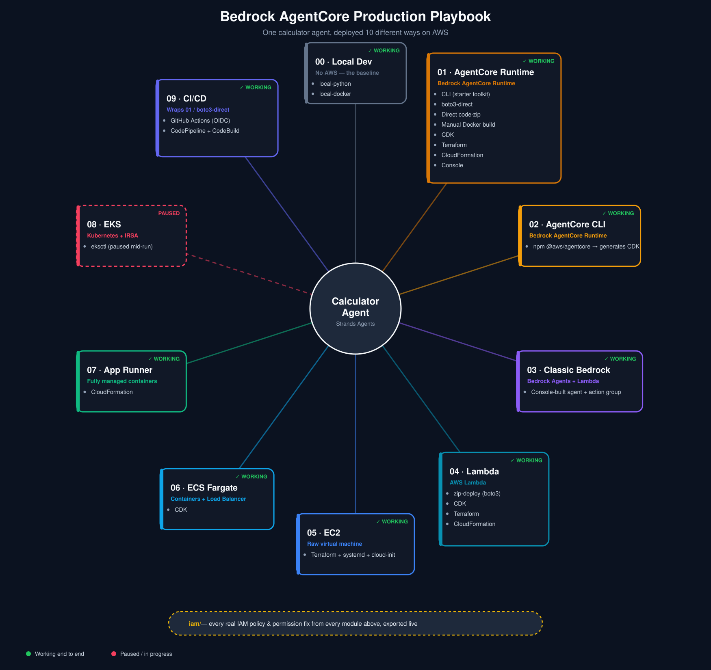
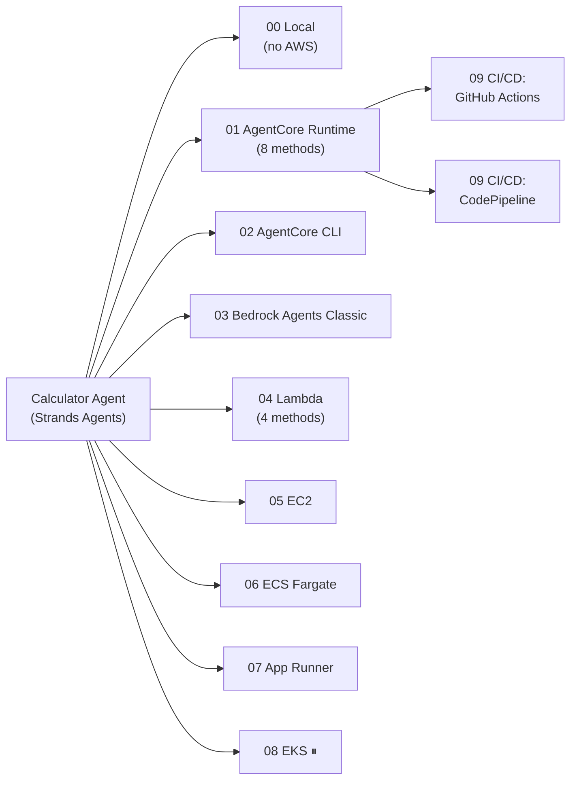

# Amazon Bedrock AgentCore — Production Deployment Playbook


[](https://github.com/vimal-dharmalingam/bedrock-agentcore-production-playbook/actions/workflows/deploy-agentcore.yml)



**One question, answered ten different ways: if you have an AI agent, what are all the real
ways to actually run it in production on AWS — and what does each one cost you in complexity,
control, and IAM permissions?**

This repo takes one deliberately simple calculator agent (built with
[Strands Agents](https://strandsagents.com)) and deploys the *exact same agent* through every
mechanism a production team would realistically evaluate — serverless, containers, a raw VM,
Kubernetes, two different CI/CD pipelines — so the tradeoffs are directly comparable instead of
theoretical. Nothing here is a toy "hello world"; every module was deployed against a real AWS
account and either works end to end or is clearly marked as paused and why.

> **The real content isn't the happy path.** Every module's README documents the actual
> AccessDenied errors, IaC gotchas, and platform quirks hit along the way, and how each was
> fixed — not edited out. Across this repo that's 40+ real, documented AWS errors and fixes.

## Contents

- [Quick start](#quick-start)
- [What's here](#whats-here)
- [Architecture](#architecture)
- [Full folder map](#full-folder-map)
- [Why so many deployment paths](#why-agentcore-and-why-so-many-deployment-paths)
- [AWS environment / IAM philosophy](#aws-environment)

## Quick start

Want to see the agent work before reading anything else? No AWS account needed for this step —
it's the same agent every other module in this repo deploys, just running locally first.

```bash
cd 00-local-dev/local-python
pip install -r requirements.txt
python app.py &
python invoke_local_agent.py "What is 25 * 4?"
```

Every other module follows the same pattern: `cd` into it, follow its README's "How to run end
to end" section, get a working deployed agent.

## What's here

| # | Module | AWS service | Status | What it teaches |
|---|--------|-------------|--------|------------------|
| 00 | [local-dev](./00-local-dev) | — (no AWS) | ✅ | The baseline: same agent, zero cloud, run with plain Python and with Docker |
| 01 | [agentcore-runtime](./01-agentcore-runtime) | Bedrock AgentCore Runtime | ✅ 8 methods | CLI vs. boto3 vs. 3 IaC tools vs. console, one managed runtime |
| 02 | [agentcore-cli](./02-agentcore-cli) | Bedrock AgentCore Runtime | ✅ | AWS's newer official CLI, generates and deploys its own CDK app |
| 03 | [classic-bedrock-agent-lambda](./03-classic-bedrock-agent-lambda) | Bedrock Agents (classic) + Lambda | ✅ | The older, separate agent service, kept for architectural contrast |
| 04 | [lambda](./04-lambda) | Lambda | ✅ 4 methods | Serverless function: zip upload vs. 3 IaC tools |
| 05 | [ec2](./05-ec2) | EC2 | ✅ | Raw VM — no managed invoke API, systemd, cloud-init from scratch |
| 06 | [ecs-fargate](./06-ecs-fargate) | ECS Fargate + ALB | ✅ | First real production topology: containers, orchestration, a load balancer |
| 07 | [app-runner](./07-app-runner) | App Runner | ✅ | Simplest managed-container option — one resource replaces ECS's whole stack |
| 08 | [eks](./08-eks) | EKS | ⏸ paused | Kubernetes + IRSA (pod-scoped IAM), parked mid-run — see its README |
| 09 | [cicd-github-actions](./09-cicd-github-actions) | GitHub Actions (OIDC) | ✅ | Push-to-deploy with no stored AWS keys |
| 09 | [cicd-codepipeline](./09-cicd-codepipeline) | CodePipeline + CodeBuild | ✅ | The same pipeline, AWS-native tooling, for direct comparison |
| — | [iam](./iam) | *(cross-cutting)* | ✅ | Every real IAM policy from every module above, exported live, with the gap each one fixed |

## Architecture



## Full folder map

```
00-local-dev/                  Baseline, no AWS deploy at all:
  local-python/                 plain `python app.py`, no Docker
  local-docker/                 same container image shape reused by every later module,
                                 run + curl-tested locally before it ever touches AWS

01-agentcore-runtime/          AgentCore Runtime, deployed 8 different ways:
  starter-toolkit-cli/         agentcore CLI (deprecated toolkit) -- fully automated build+deploy
  boto3-direct/                starter toolkit's Python API, scripted rather than CLI-driven
  direct-code-zip/             no container at all -- code zip uploaded straight to S3
  manual-container-build/      hand-written Dockerfile, manual docker build/push/ECR/deploy
  cdk/                         hand-written CDK
  terraform/                   AWS's AgentCore Terraform provider
  cloudformation/               raw, hand-authored YAML template
  console/                     AWS Management Console click-through
  scripts/                     list/delete agent runtime utilities (boto3)

02-agentcore-cli/              AWS's newer @aws/agentcore CLI -- generates and deploys via CDK

03-classic-bedrock-agent-lambda/   The OLDER "Bedrock Agents" service (separate from AgentCore),
                                    action-group Lambda -- kept for architectural comparison,
                                    see its README for platform status (entering maintenance
                                    mode July 2026)

04-lambda/                     Agent as a standalone Lambda function, 4 ways:
  zip-deploy/ cdk/ terraform/ cloudformation/

05-ec2/                        Raw VM -- FastAPI + systemd service, Terraform-provisioned
  terraform/

06-ecs-fargate/                Containerized, orchestrated, behind a real Application Load
  cdk/                          Balancer -- first genuine production topology in the repo

07-app-runner/                 Simplest managed-container option -- one resource replaces
  cloudformation/                ECS's cluster/task-def/service/ALB/target-group entirely

08-eks/                        Kubernetes -- eksctl cluster + IRSA-scoped pod IAM (paused
                                mid-run, see its README for status)

09-cicd-github-actions/        Push-to-deploy pipeline wrapping 01-agentcore-runtime/boto3-direct
                                via OIDC-federated GitHub Actions (no stored AWS keys)

09-cicd-codepipeline/          Same pipeline, AWS-native: CodePipeline + CodeBuild instead of
                                GitHub Actions, for a direct side-by-side comparison

iam/                           Cross-cutting: every real IAM policy from every module above,
                                exported live from the account, with a narrative README tying
                                each one to the gap it fixed
```

Each module folder is self-contained and runnable on its own -- the same `my_calc_agent.py` is
deliberately duplicated across folders rather than shared, so every deployment method can be
tried independently without cross-folder dependencies.

See [ROADMAP.md](./ROADMAP.md) for full status, architecture notes, and how this maps to the
AWS Certified Generative AI Developer – Professional exam's scope.

## Why AgentCore, and why so many deployment paths

Amazon Bedrock AgentCore is AWS's managed runtime for hosting agentic applications built with
any framework (Strands, LangGraph, CrewAI, etc.), separate from the older, more constrained
"Bedrock Agents" service. Deploying the *same* agent multiple ways surfaces real tradeoffs that
don't show up from reading docs alone:

- **CLI automation vs. raw boto3** — fast to start vs. full control over every API call
- **Container images vs. code-zip packaging** — portability vs. simplicity
- **Managed runtime vs. raw compute** — AgentCore/Lambda/App Runner hide the "how do I even call
  this" problem; EC2/EKS make you build it yourself
- **Imperative one-shot API calls vs. declarative IaC** — quick and scriptable vs. reproducible
  and diffable, with real state to manage

## AWS environment

Deliberately run under a narrow-permission IAM user rather than an admin account, so every new
AWS feature tends to surface a real permission gap -- a deliberate demonstration of
least-privilege design, not something to route around with broader access. Details in
[ROADMAP.md](./ROADMAP.md#working-iam-user).

## License

[MIT](./LICENSE)
