# Technical Takeaways & Exam Notes

Personal study notes distilled from building all 10 deployment modules in this repo. Four parts: reusable technical patterns worth knowing cold (including a full operational comparison of every method), a side-by-side workflow diagram for every method, a decision framework for choosing between them, and how the project maps to the AWS Certified Generative AI Developer – Professional (AIP-C01) exam guide. Not part of the public README/ROADMAP narrative — this is a working reference, save it to git or not.

## Part 1 — Technical takeaways

### 1. Compute-target credential patterns (the core comparison)

Every compute target answers "how does my running code get AWS credentials" differently. This is the single most interview-relevant table in the whole project:

| Target | Credential mechanism | Scope |
|---|---|---|
| Lambda | Execution role attached to the function | Per-function |
| EC2 | Instance profile attached to the instance | Per-instance (every process on the box shares it) |
| ECS Fargate | Task role, set per task definition | Per-task-definition |
| App Runner | Instance role (same idea as Lambda's) | Per-service |
| EKS | IRSA — IAM Roles for Service Accounts | **Per-pod**, via the cluster's own OIDC provider — the only pattern here that isn't node/instance-scoped |

IRSA is the one worth explaining in depth if asked: a Kubernetes `ServiceAccount` is annotated with a role ARN, the role's trust policy trusts only that exact `system:serviceaccount:<namespace>:<name>` subject via the cluster's OIDC identity provider, and the EKS Pod Identity webhook injects temporary credentials into the pod automatically. No shared node-level credentials, no code changes.

### 2. IAM patterns worth knowing cold

- **10-managed-policy-per-user cap is real and gets hit fast.** The fix isn't "make a new policy per fix" — it's `aws iam create-policy-version --set-as-default` on an existing, topically-related policy. This repo deliberately hit the cap to force practicing that habit.
- **5-versions-per-policy cap stacks on top of the above.** Once you're extending in place regularly, `aws iam delete-policy-version` on the oldest superseded version becomes routine housekeeping, not an edge case.
- **AWS-managed policies count toward the same attachment cap as customer-managed ones.** Attaching one broad AWS-authored policy (e.g. `BedrockAgentCoreFullAccess`) uses a slot exactly like a narrow custom one does — easy to forget when budgeting toward the cap of 10.
- **Who executes the API call determines who needs the grant, and it's not always who you'd guess.** CloudFormation and the AWS Console run resource-creation calls under the *caller's own credentials* — not a service role. CDK instead delegates to a separately-bootstrapped execution role. Same "deploy a stack" action, two completely different principals actually doing the work.
- **Different IaC tools trigger different AccessDenied errors for the identical underlying resource.** CDK, CloudFormation, Terraform, and eksctl (which is CloudFormation one layer removed) each make their own distinct background read/list/describe calls before or after the real create/update call. A permission grant that satisfies one tool does not automatically satisfy another for the same resource type.
- **The first-ever resource of a given type in an account often needs a bootstrap grant beyond normal CRUD** — `iam:CreateServiceLinkedRole` came up for App Runner's `AWSServiceRoleForAppRunner`, and the same pattern is anticipated for EKS/Auto Scaling service-linked roles.
- **A UI surfaces more distinct gaps than any single script.** The AWS Console click-through method alone found 4 new IAM gaps deploying the exact same AgentCore Runtime — more than any CLI or IaC method — because a form has to support every possible path through it, not just the one action a script takes.
- **IAM inline policies have a 2048-character limit.** Anything beyond a trivial one-off grant belongs in a customer-managed policy, not inline.
- **CloudFormation truncates long logical IDs when generating physical resource names** (IAM roles especially, due to the 64-char limit). `aws cloudformation describe-stack-resources --logical-resource-id <id>` gets the real physical name reliably; guessing via `iam list-roles` substring matching often misses.
- **A stack stuck in `ROLLBACK_COMPLETE` cannot be updated**, even after the root-cause permission gap is fixed — `delete-stack` + `wait stack-delete-complete` first, then redeploy fresh.

### 3. IaC tool comparison, in practice (not just in theory)

- **CDK**: delegates actual AWS API calls to a bootstrapped execution role (`cdk-hnb659fds-*`). `cdk bootstrap` itself needs broad/admin-level permissions as a one-time step. `ecs.ContainerImage.from_registry(uri_string)` vs `.from_ecr_repository(repo_object)` look interchangeable but aren't — only the latter gives CDK a real object to call `.grantPull()` on; the former silently leaves the execution role with zero ECR permissions, and CDK gives no warning at synth or deploy time.
- **CloudFormation**: runs under the caller's own credentials directly. `AWS::CodeStarConnections::Connection` is a good example of a resource CloudFormation can *create* but not fully activate — the GitHub OAuth handshake is deliberately console-only, no API path exists.
- **Terraform**: `templatefile()` substitutes `${...}` anywhere it appears in the template file — including inside what's meant to be a plain descriptive comment. Writing a variable's literal dollar-brace syntax in template prose corrupts the whole rendered file. Also: the default behavior for a `user_data` change on an `aws_instance` is an in-place stop/modify/start, not a replacement — but EC2 user-data only executes once, at first boot, via cloud-init, so a "successful" apply can silently leave the instance running its old boot state. `user_data_replace_on_change = true` forces a real replace.
- **eksctl**: not a general-purpose IaC engine — a domain-specific CLI that generates and runs its own CloudFormation stacks underneath, inheriting CloudFormation's "runs under the caller's credentials" behavior one layer removed from view. Controls its own stack-naming convention (`eksctl-<cluster>-cluster`), which can break a resource-scoped IAM policy pattern built around a different naming convention.

### 4. CI/CD: two tools, one deploy target, genuinely different shapes

- **GitHub Actions (OIDC)**: no stored AWS keys — a GitHub-issued JWT is traded for temporary credentials via a federated IAM role's trust policy. Real bug hit: GitHub's July 2026 "immutable subject claims" rollout silently changed the default token format, breaking the trust policy's `sub` condition in a way that looked exactly like a missing permission until the actual JWT was decoded.
- **AWS CodePipeline + CodeBuild**: splits "orchestration" (CodePipeline, never runs a shell command itself) from "compute" (CodeBuild, runs `buildspec.yml`) into two services with two separate IAM roles — where GitHub Actions collapses both into one workflow file and one role. Authenticated via a CodeStar Connection (persistent OAuth trust) rather than per-run OIDC.
- **Non-IAM bug, CodeBuild**: the shell's working directory persists across *all* phases of one build (`install`/`build`/`post_build`), not resetting per phase. A `cd` in `install` plus a second relative `cd` of the same name in `build` tries to descend into a nested subdirectory that doesn't exist. Fix: always `cd` to the absolute `$CODEBUILD_SRC_DIR`.
- **Non-IAM bug, YAML**: `>` (folded) block scalars collapse newlines into spaces; `|` (literal) preserves them. An inline multi-line `python -c "..."` smoke test written with `>` silently flattened into one syntactically invalid line. Durable fix wasn't switching scalar types — it was extracting a real shared `smoke_test.py` file used by both pipelines, removing the fragile inline-quoting pattern entirely.
- **The deploy logic itself doesn't change across CI/CD tools** — only the orchestration layer around it. Worth saying explicitly in an interview: the same `deploy_my_agent.py` / `Runtime.launch()` call graph needs the same AWS actions regardless of which pipeline tool is driving it.

### 5. Other real bugs worth remembering

- `bedrock_agentcore` SDK's local dev server binds `127.0.0.1` unless `DOCKER_CONTAINER=1` is set — the container looks healthy, but every external request just gets an empty reply with no error logged.
- Building arm64 Docker images on x86 Windows goes through QEMU emulation — if pip/uv falls back to compiling anything from source inside that emulation, it can hang 30+ minutes. Fix: pre-fetch wheels on the host with `uv --only-binary=:all:`, never `pip install` inside the emulated container.
- A never-stabilizing ECS deployment can take up to 3 hours to fail and roll back on its own if `circuitBreaker` isn't enabled on the service (CDK warns, doesn't default it on). Killing the local `cdk deploy` CLI process does not stop CloudFormation, which keeps working server-side regardless.
- Amazon Linux 2023's unversioned `python3` package is 3.9 — too old for libraries requiring >=3.10. Install a versioned package (`python3.11`) explicitly.
- Debugging a headless EC2 instance with no SSH/SSM: `exec > >(tee /var/log/x.log) 2>&1` plus `set -x` in the boot script (not a plain `>` redirect) is what makes the EC2 console's "Get system log" actually useful.
- Windows-specific: `cmd.exe` treats `<`/`>` as redirection operators even outside code context — a placeholder like `<VALUE>` fails with file-not-found, not a syntax error. Windows console's default codepage isn't UTF-8, breaking on emoji in model responses or in `aws logs get-log-events` output — worked around by calling boto3 directly and writing output with explicit `encoding="utf-8"`.

### 6. How each method differs — the full operational comparison

The credential table in section 1 only covers "how does it get permissions." The bigger picture, method by method:

| Method | Who runs the reasoning loop | Ops you own | Scaling | Cold start | Cost when idle | Best fit |
|---|---|---|---|---|---|---|
| Local dev | You, on your machine/container | Everything (it's local) | N/A | N/A | Free (your own compute) | Proving the agent logic works before any deploy mechanism is layered on |
| AgentCore Runtime | AWS-managed | Almost none — AWS handles scaling, session isolation, identity | Automatic, managed | Low (managed warm infra) | Pay-per-use, no idle charge | The default choice for a new Bedrock-native agent — least ops for the most agent-specific features (memory, identity, observability built in) |
| AgentCore CLI | Same as AgentCore Runtime (it deploys to it) | Same as above, plus it manages the CDK app for you | Same as above | Same as above | Same as above | Same target as AgentCore Runtime, but when you want a faster scaffold/local-dev-server loop or multi-framework support (LangGraph, LangChain, etc.) |
| Classic Bedrock Agent + Lambda | AWS-managed (older reasoning loop) | Low — but the service itself is entering maintenance mode (July 2026) | Automatic | Low | Pay-per-use | Legacy/existing investments only — don't start new work here |
| Plain Lambda | You, restructured as `lambda_handler` | Function code + IAM only | Automatic, per-invocation | Can be noticeable (esp. with large deps) | Free when idle (no invocations = no charge) | Event-driven, sporadic traffic, simple request/response, no need for a long-lived process |
| EC2 | You, entirely — you wrote the FastAPI wrapper, systemd unit, boot script | Full stack: OS patching, process supervision, networking, scaling | Manual, or bolt-on Auto Scaling yourself | None once running (always-on process) | Full instance cost 24/7 regardless of traffic | Full control, custom OS-level dependencies, or workloads that don't fit a managed compute model |
| ECS Fargate | You (container), AWS (orchestration) | Container image + task/service definitions, load balancer | Managed via service Auto Scaling | Low-moderate (task startup) | Pay for running tasks only, but typically kept warm | Production container workloads needing real orchestration (multiple tasks, rolling deploys, ALB routing) without managing servers |
| App Runner | You (container), AWS (everything else) | Just the container image | Fully managed, scales to zero | Low | Can scale to zero — cheapest "real service" option when idle | Simplest path to a reachable HTTPS container service, no VPC/ALB/target-group setup wanted |
| EKS | You (pods), AWS (control plane) | Cluster config, node groups, IRSA, k8s manifests — the largest ops surface here | Fully manual (or Cluster Autoscaler/Karpenter on top) | Depends on pod readiness/warm pool | Control plane cost 24/7 plus node cost regardless of traffic | Already standardized on Kubernetes elsewhere in the org, multi-tenant workloads needing pod-level IAM isolation (IRSA) |
| CI/CD (GitHub Actions / CodePipeline) | N/A — this wraps the *deploy* of one of the above, not the runtime itself | Pipeline definition + IAM roles for the pipeline | N/A | N/A | Pay per build minute (both tools) | Not a runtime choice at all — layer this on top of whichever compute target above once it's proven manually |

## Part 2 — Workflow diagrams for every method, side by side

The request/response path for each method, so the differences are visible at a glance rather than scattered across ten separate READMEs.

**1. Local dev**
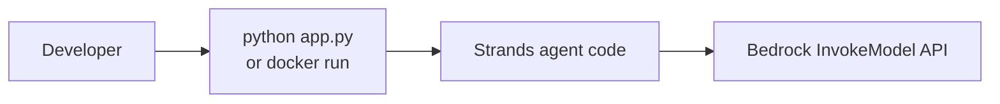

**2. AgentCore Runtime (any of the 8 deploy methods — CLI, boto3, zip, manual container, CDK, CloudFormation, Terraform, Console)**
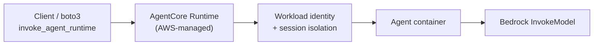
*The 8 deploy methods only change how the container/config gets onto the Runtime — the request path above is identical regardless of which one was used.*

**3. AgentCore CLI**
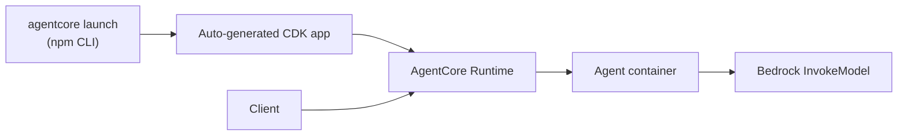

**4. Classic Bedrock Agent + Lambda**
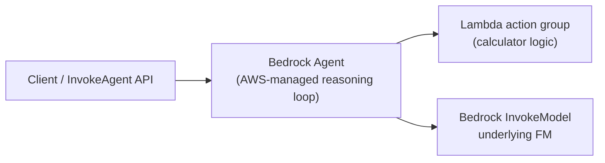

**5. Plain Lambda**
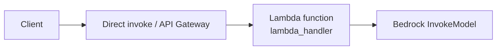

**6. EC2**
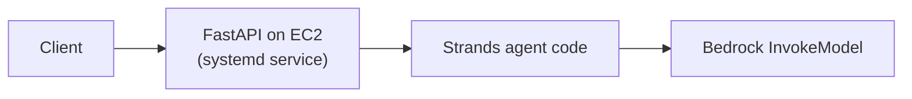

**7. ECS Fargate**
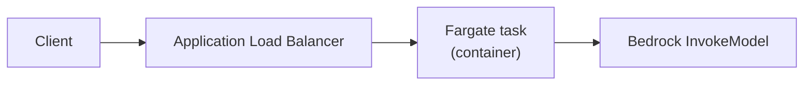

**8. App Runner**
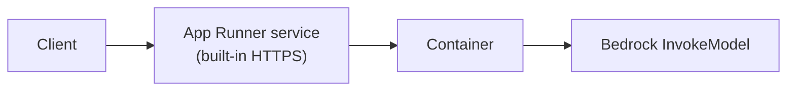

**9. EKS**
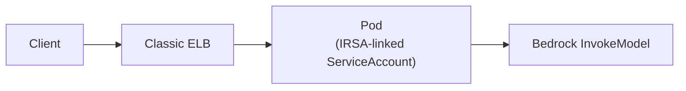

**10. CI/CD (GitHub Actions or CodePipeline+CodeBuild — deploy-time flow, not a runtime)**
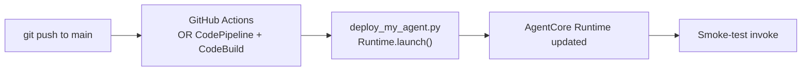

## Part 3 — Decision framework: which method to actually choose

The comparison table in section 6 is the reference; this is the shortcut version for a real decision:

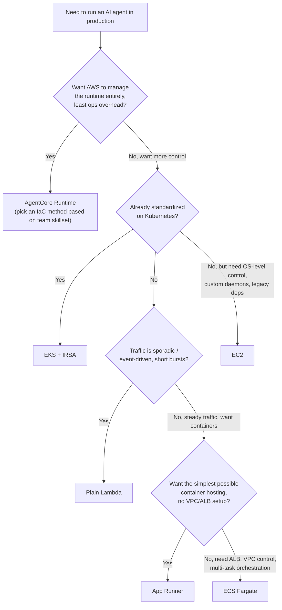

Once the compute target is picked, two more decisions layer on top:

- **Which IaC tool?** CDK if the team is Python/TypeScript-native and wants higher-level constructs (`grantPull()`, `grantInvoke()`, etc. handling IAM wiring for you). CloudFormation if you want zero third-party tooling, pure AWS-native, and full control over every resource property. Terraform if the org is multi-cloud or already standardized on it — but remember it's not tested on the AIP-C01 exam, so treat it as a portfolio/job-market choice, not an exam-prep one. eksctl specifically for EKS bootstrapping — it isn't a general competitor to the other three, it only applies once EKS itself is the chosen compute target.
- **Which CI/CD tool?** GitHub Actions if the codebase already lives on GitHub and keyless OIDC auth is wanted with minimal AWS-side setup. AWS CodePipeline + CodeBuild if the requirement is to stay fully within AWS-native tooling (compliance, no third-party CI dependency, or — specifically for this project's exam goal — because CodePipeline/CodeBuild is the version actually tested on AIP-C01, not GitHub Actions.

## Part 4 — Exam alignment: AWS Certified Generative AI Developer – Professional (AIP-C01)

Cross-checked against the official exam guide (docs.aws.amazon.com/aws-certification/latest/ai-professional-01/).

### Confirmed in-scope, validated by this project

| Exam-relevant service/topic | Covered by | Notes |
|---|---|---|
| Amazon Bedrock AgentCore (named explicitly) | `01-agentcore-runtime` (8 methods), `02-agentcore-cli` | Classic "Bedrock Agents" is NOT named separately on the exam — only generic "Amazon Bedrock" — so `03` is conceptual value, not a heavily-tested topic by name |
| AWS Lambda | `04-lambda` (4 IaC methods) | |
| Amazon EC2 | `05-ec2` | |
| Amazon ECS / Fargate | `06-ecs-fargate` | |
| AWS App Runner | `07-app-runner` | |
| Amazon EKS | `08-eks` | Paused mid-run, scaffolding complete |
| Amazon ECR | Used across every containerized module | |
| AWS CDK | `01/cdk`, `04/cdk`, `06-ecs-fargate` | In scope |
| AWS CloudFormation | `01/cloudformation`, `04/cloudformation`, `07-app-runner`, `09-cicd-codepipeline` | In scope |
| AWS CodePipeline + CodeBuild | `09-cicd-codepipeline` | Named explicitly, Task 2.3.5 |

### Confirmed out of scope (built anyway, for the portfolio — just don't over-invest exam study time here)

- **Terraform** — absent from the exam's in-scope services list, despite being used in `01/terraform`, `04/terraform`, `05-ec2`. Keep it for job-search value, deprioritize for exam prep.
- **GitHub Actions** — not an AWS service, won't appear on the exam despite `09-cicd-github-actions` being a full module. The exam tests the CodePipeline/CodeBuild equivalent instead.
- **AWS CloudShell** — despite being the tool used constantly for IAM debugging in this project, it's explicitly not exam-tested.

### Gaps — exam topics not yet covered by any module (from Task 2.1, "Implement agentic AI solutions and tool integrations")

- **MCP servers hosted on Lambda (stateless) or ECS (complex)** — a distinct pattern from `03`'s "Lambda as a Bedrock action group": here the agent talks to an MCP server, not a direct action group. `02-agentcore-cli`'s scaffold already has a dormant MCP client stub worth activating.
- **AWS Step Functions** — appears repeatedly across exam tasks: ReAct/chain-of-thought orchestration, safeguarded workflow stopping conditions, human-in-the-loop review/approval, dynamic model routing. Not represented anywhere in this repo yet.
- **AWS Agent Squad** — named multi-agent framework, not yet explored.
- **Amazon Bedrock Prompt Flows / Prompt Management** — named services, not yet explored.
- **Kiro** — AWS's AI-native IDE, listed under Developer Tools; basic familiarity is worth having.

### Suggested next study actions

1. Build a minimal Step Functions module wrapping the existing calculator agent (ReAct-style orchestration is the most exam-relevant angle).
2. Stand up one MCP server on Lambda and point `02-agentcore-cli`'s existing MCP client stub at it — closes the single largest named-but-unbuilt gap.
3. Read through Bedrock Prompt Flows / Prompt Management docs even without a full module — enough to answer conceptual exam questions.
4. Skim Kiro's product page for basic familiarity — low-effort, exam-guide-listed.
5. Resume `08-eks` when time allows — EKS is confirmed in-scope, and IRSA is a strong interview talking point on its own even without the module marked fully complete.
