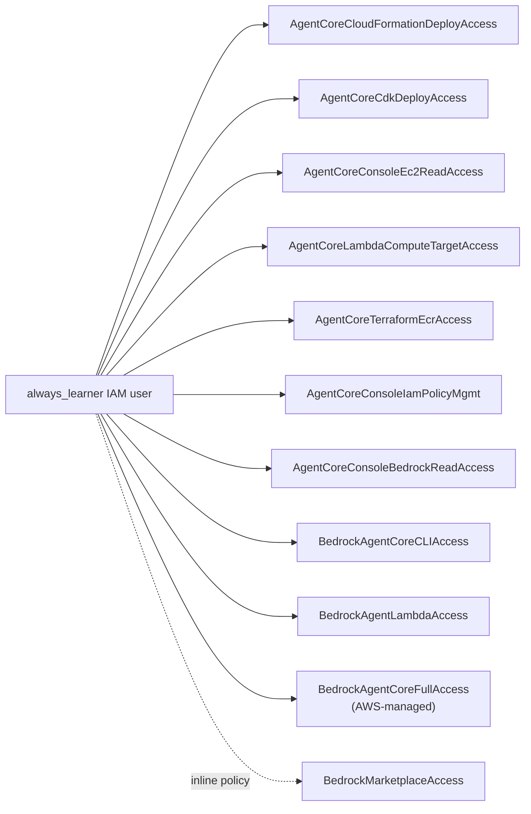

# iam/ — the permission-debugging trail, consolidated

## At a glance

| | |
|---|---|
| **Scope** | Cross-cutting — every real IAM policy touched across all 10 modules, not a deploy target itself |
| **Contents** | 10 customer-managed policies + 1 inline + 1 AWS-managed, exported live from the account (not retyped) |
| **Status** | ✅ Complete — exactly at `always_learner`'s 10-managed-policy attachment cap |
| **Real errors documented** | Every gap from every module, indexed by policy, plus 6 reusable patterns worth knowing cold |
| **What's different here** | Not a deploy flow — a narrative index tying every permission gap in the repo back to the exact policy and fix |

Every module in this repo (`00` through `09`) was built against a **deliberately narrow** IAM
user, `always_learner`, rather than an admin/broad-access account. That was a design choice, not
an oversight: the goal was to hit real `AccessDenied` errors, root-cause them the way you would
in a production AWS account with least-privilege enforced, and document the fix -- not to route
around IAM by granting everything upfront. This folder pulls that trail together in one place,
since it's scattered one gap at a time across nine module READMEs otherwise.

If you only read one part of this whole repo before an interview, make it this folder -- it's the
part that actually demonstrates operating AWS under real constraints, not just following a
tutorial with admin access.

## What's here

`always-learner-policies/` -- a snapshot of every policy attached to `always_learner`, exported
directly from the live AWS account (via `aws iam get-policy-version`), not retyped from memory.
Ten customer-managed policies plus one inline policy -- exactly at the account's 10-managed-
policy-per-user hard cap, which is itself one of the recurring lessons below.

| Policy | Built for | Key permissions | Notable gotcha |
|---|---|---|---|
| `AgentCoreCloudFormationDeployAccess` | `01`/`07` CloudFormation deploys | `cloudformation:*Stack*` scoped to `stack/CalcAgent*`, `apprunner:*`, one-time `iam:CreateServiceLinkedRole` | CloudFormation runs resource-creation API calls under the *deploying user's own credentials*, not a service role -- `always_learner` needed direct `apprunner:*`, not just CFN permissions |
| `AgentCoreCdkDeployAccess` | `01`/`06` CDK deploys | Stack access scoped to `stack/AgentCore-*`, CDK asset bucket, `sts:AssumeRole` on `cdk-hnb659fds-*` | CDK's actual AWS actions run through the *bootstrap* exec role, not `always_learner` directly -- this policy only needed to grant enough to kick off and monitor the deploy, not perform it |
| `AgentCoreConsoleEc2ReadAccess` | `05-ec2`, plus ECS read for `06` debugging | EC2 describe/run/stop/start, security groups, `ecs:List*`/`Describe*` | Hit the **5-versions-per-managed-policy cap** here -- had to delete the oldest version (`v1`) before a new one could be added, once `EcsReadAccessForDebugging` needed adding on top of the original EC2 statements |
| `AgentCoreLambdaComputeTargetAccess` | `04-lambda` | Lambda function lifecycle scoped to `function:calc_agent_*` | Naming-driven gap: an earlier attempt used a stack/function name that didn't match this policy's resource pattern -- fixed by renaming the resource, not widening the policy |
| `AgentCoreTerraformEcrAccess` | `01`/`04` Terraform | ECR repo lifecycle scoped to `repository/bedrock-agentcore-*` | Terraform's own AWS provider makes different background API calls than CDK or CloudFormation for the *same* resource type, so this needed its own distinct grant even though ECR access already existed elsewhere |
| `AgentCoreConsoleIamPolicyMgmt` | Console click-through method | `iam:CreatePolicy`/`CreatePolicyVersion`/etc. scoped to `policy/*BedrockAgentCore*` | The AWS Console does far more IAM introspection than any single CLI/IaC tool -- this was the single biggest source of new gaps in the whole project, since a UI has to support every possible path through a form |
| `AgentCoreConsoleBedrockReadAccess` | Console click-through method | `bedrock:ListFoundationModels`, `ListInferenceProfiles` | Read-only, but still denied by default -- narrow IAM blocks *listing*, not just creating |
| `BedrockAgentCoreCLIAccess` | `01` starter-toolkit-cli / boto3-direct (local runs) | IAM role mgmt scoped to `*BedrockAgentCore*`, CodeBuild, S3, ECR, `iam:PassRole` | The starter toolkit's underlying AWS call graph (CodeBuild + S3 + ECR + IAM, not just a single "deploy" API) had to be reverse-engineered from `AccessDenied` messages one at a time |
| `BedrockAgentLambdaAccess` | `03-classic-bedrock-agent-lambda` | Classic Bedrock Agent management, Lambda, scoped IAM role/instance-profile mgmt | Classic Bedrock Agents and AgentCore Runtime are different services with entirely separate IAM action namespaces (`bedrock:*Agent*` vs `bedrock-agentcore:*`) despite the similar naming |
| `BedrockMarketplaceAccess` *(inline)* | First-ever model invocation | `aws-marketplace:Subscribe`/`ViewSubscriptions` | Third-party foundation models on Bedrock require an AWS Marketplace subscription step the *first* time -- a one-time gap unrelated to any specific module |
| `AWS-managed-BedrockAgentCoreFullAccess` *(AWS-managed, not customer-authored)* | Baseline AgentCore Runtime access | `bedrock-agentcore:*`, plus supporting KMS/S3/Secrets Manager/observability grants AWS bundles with it | Worth knowing: **AWS-managed policies count toward the same 10-per-user attachment cap as customer-managed ones** -- attaching this one broad policy used up one of the ten slots just as much as any narrow custom one did, which is part of why the cap got hit |

`09-cicd-github-actions/iam/` (not duplicated here, see that folder directly) -- a completely
different kind of principal: `GitHubActionsAgentCoreDeployRole`, an OIDC-federated IAM *role*
assumable only by GitHub Actions running this specific repo's `main` branch, not a human IAM user.
Its trust policy and permissions policy are documented there since they're tightly coupled to that
module's pipeline. Real gaps hit on that role specifically: GitHub's July 2026 "immutable subject
claims" OIDC rollout breaking the trust policy's `sub` condition, plus missing
`bedrock-agentcore:CreateAgentRuntimeEndpoint` and `CreateWorkloadIdentity` grants that only
surfaced once the underlying `CreateAgentRuntime` call itself succeeded.

`03-classic-bedrock-agent-lambda/iam/` (also not duplicated here) -- the very first IAM policy
built in this project, for classic Bedrock Agents + Lambda action groups.

## Patterns worth knowing cold for an interview

These are the genuinely reusable lessons -- not module-specific, but the kind of thing that comes
up in any real AWS IAM debugging session:

**Extend, don't sprawl.** AWS caps IAM users at 10 attached managed policies. Once you're
building anything beyond a toy project, "one new policy per feature" runs out fast -- the durable
pattern is `aws iam create-policy-version --set-as-default` on an existing, topically-related
policy instead of creating a new standalone one. This repo hit that cap exactly, by design, to
force practicing the extend-in-place habit rather than avoiding it.

**Policy versions cap too.** Five versions per managed policy. Once you're extending in place
regularly, you'll eventually need `aws iam delete-policy-version` on the oldest fully-superseded
version before a new one can be created.

**Different IaC tools make different background API calls for the same resource.** CDK,
CloudFormation, and Terraform each triggered distinct, tool-specific `AccessDenied` errors while
deploying the *identical* underlying AWS resource, because each tool's client library calls a
different set of read/list/describe APIs internally before or after the actual create/update call.
Don't assume a permission grant that worked for one IaC tool covers another.

**Who actually executes the API call matters.** CloudFormation and the AWS Console run
resource-creation calls under the *calling principal's own credentials*. CDK instead delegates
to a separately-bootstrapped execution role. This changes exactly which principal needs which
grant, and is easy to get backwards.

**The first-ever resource of a given type in an account often needs a bootstrap permission beyond
normal CRUD.** Hit twice, independently: `iam:CreateServiceLinkedRole` for App Runner's
`AWSServiceRoleForAppRunner` (07), and again conceptually for AgentCore's own several
service-linked roles baked into the AWS-managed `BedrockAgentCoreFullAccess` policy above.

**A UI surfaces more gaps than any single script.** The AWS Console click-through method alone
found more distinct new IAM gaps than any CLI, CDK, CloudFormation, or Terraform run -- because a
form has to support every possible path through it, not just the one action a script takes.

**AWS-managed policies count toward the same per-user attachment cap as customer-managed ones.**
Not obvious until you hit it -- attaching one broad AWS-authored policy uses up a slot exactly
like a narrow custom one does.

## Note on what's *not* here

No actual credentials -- access keys, secret keys, session tokens -- appear anywhere in this
folder, this repo, or its git history (verified directly, including history predating a
`git-filter-repo` cleanup earlier in the project). Everything in `always-learner-policies/` is a
permission *definition* (what actions/resources are allowed), which is fundamentally different
from a credential (something that authenticates as you). The AWS account ID does appear
throughout these files as part of resource ARNs -- a deliberate tradeoff for portfolio
authenticity over full anonymization, consistent with the rest of this repo.
