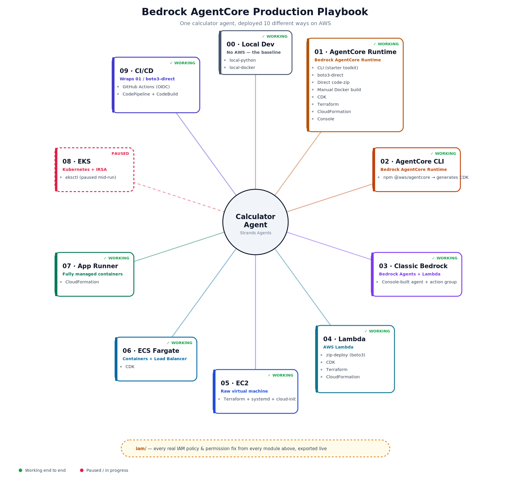

# 10 Ways to Deploy an AI Agent on AWS

*Same agent, every method, all the real errors included*

If you have an AI agent ready, what's actually the right way to run it in production on AWS? Lambda? A container behind a load balancer? Kubernetes? AWS's new managed AgentCore Runtime?

I didn't want to guess. So I took one deliberately simple calculator agent — built with the [Strands Agents](https://strandsagents.com) framework — and deployed the *exact same agent* ten different ways, on a real AWS account, under a deliberately narrow IAM user (no admin shortcuts). The goal was to compare the tradeoffs directly instead of reading about them.

This article is the tour. Full code, every real error hit along the way, and the fix for each one, is in the GitHub repo linked at the end.

**Steps involved in this project:**

1. Local dev (no AWS at all)
2. Bedrock AgentCore Runtime — 8 different ways
3. AWS's newer AgentCore CLI
4. Classic Bedrock Agents + Lambda
5. Plain AWS Lambda
6. Raw EC2
7. ECS Fargate behind a load balancer
8. App Runner
9. EKS (Kubernetes)
10. CI/CD — GitHub Actions and AWS CodePipeline, wrapping the same deploy

**Let's go through each one.**

## 1. Local dev — prove the agent works before AWS gets involved

Before touching any cloud resource, the agent runs two ways locally: plain `python app.py`, and the same code in a Docker container. No AWS deploy target, but it still makes a real Bedrock `InvokeModel` call — there's no offline mode.

The point isn't the agent logic. It's ruling out "is my code broken" before any deployment mechanism gets layered on top. If something breaks here, it breaks everywhere downstream too.

## 2. Bedrock AgentCore Runtime — 8 ways to deploy the same thing

This is where most of the depth is. AgentCore Runtime is AWS's new managed runtime for agentic apps, and I deployed to it eight separate ways:

- The Python starter-toolkit CLI (`agentcore configure` / `launch`)
- Raw boto3, calling the SDK directly
- A zip-upload deploy with no container at all
- A hand-built Docker image, pushed to ECR manually
- Hand-written CDK
- Hand-written CloudFormation
- Terraform (`hashicorp/aws`'s native resource)
- The AWS Console, pure click-through

The console alone surfaced **4 new IAM permission gaps** — more than any single CLI or IaC tool — because a UI has to support every possible path through a form, not just the one action a script takes. That's a good interview talking point on its own.

## 3. AgentCore CLI — the newer, official way

AWS shipped a newer `@aws/agentcore` CLI (npm, not pip) that generates and deploys its own CDK app for you. Supports more frameworks than the old toolkit (LangGraph, LangChain, Google ADK, OpenAI Agents, not just Strands), and comes with a local dev server with hot reload built in.

## 4. Classic Bedrock Agents + Lambda

A completely different, older AWS service — not AgentCore at all. AWS manages the reasoning loop; you just supply a Lambda function as the "tool" the agent calls out to. Worth knowing this one is entering maintenance mode (July 2026), but it's still a useful architectural contrast: no Strands framework, no container, no AgentCore Runtime anywhere in the picture.

## 5. Plain AWS Lambda

Strip AgentCore out entirely. The same agent, restructured as a plain `lambda_handler(event, context)`. Deployed 4 ways here (zip/boto3, CDK, Terraform, CloudFormation) since Lambda is simple enough to be worth the full IaC comparison. Fundamentally different hosting model from AgentCore Runtime: request/response, not an always-listening server.

## 6. Raw EC2

The first compute target with **no managed invoke API in front of it**. Nothing calls the agent for you — I had to build that part myself: a FastAPI wrapper, a systemd service so it survives reboots, and a cloud-init boot script. Terraform did real infrastructure provisioning here (AMI, security group, IAM instance profile), not just pointing at a pre-built artifact.

This was, by a wide margin, the longest debugging chain in the whole project. Five separate root causes before it worked, including a boot script that broke because a *comment* inside it used the same `${...}` syntax Terraform's template engine looks for — and got silently overwritten with real file content mid-comment.

## 7. ECS Fargate — the first real production topology

Containers, orchestrated, behind a real Application Load Balancer. First module where the environment is a Docker image built once ahead of time, not assembled live by a boot script.

The interesting bug here: I initially pointed the container definition at a raw ECR URI string instead of a proper repository reference. CDK had no way to know it needed to grant pull access, so the auto-created execution role ended up with zero ECR permissions. Fifteen tasks crash-looped identically before I caught it.

## 8. App Runner — the simplest option by a wide margin

One resource — `AWS::AppRunner::Service` — replaces everything ECS needed: cluster, task definition, service, load balancer, target group, security groups. No VPC, no NAT Gateway. Built-in HTTPS. If you just want a container running and reachable with the least ceremony, this is it.

## 9. EKS — Kubernetes, and a genuinely different IAM pattern

Kubernetes, built with `eksctl`. This introduced IRSA (IAM Roles for Service Accounts) — the only *pod-scoped*, not node-scoped, credential pattern anywhere in the project. A Kubernetes ServiceAccount gets trusted by an IAM role through the cluster's own OIDC provider, so only the pod gets Bedrock access, not every workload sharing that node.

Full disclosure: this one is paused mid-run. eksctl's cluster turnaround (15–20 minutes) and its permission surface — by far the widest of any module here — made it the slowest to iterate on. The scaffolding, the anticipated IAM gaps, and the one real error already hit are all documented; I'm picking it back up later.

## 10. CI/CD — two ways to make "push to deploy" real

Wrapped the same AgentCore Runtime deploy in two separate pipelines, targeting the identical script both times, so the comparison is direct:

- **GitHub Actions**, authenticated via OIDC — no stored AWS keys anywhere. This is where I hit the best debugging story in the whole project: GitHub's July 2026 "immutable subject claims" rollout silently changed the default token format, breaking my trust policy in a way that looked exactly like a missing permission. Took decoding the actual OIDC JWT to find the real cause.
- **AWS CodePipeline + CodeBuild** — the AWS-native equivalent, which splits "orchestration" and "compute" into two separate services (and two separate IAM roles) where GitHub Actions collapses both into one workflow file.

## What I'd tell someone starting this

Pick the narrowest IAM user you can stand, not an admin account. Every AccessDenied error you hit and fix yourself teaches you more about how a service actually works than any amount of reading docs with broad permissions ever will. That was the whole design constraint behind this project, and it's the reason there are 40+ real, documented errors across these ten modules instead of ten clean "it just worked" writeups.

**Full code, every module's README with exact rerun commands, and the complete IAM permission trail:**
[github.com/vimal-dharmalingam/bedrock-agentcore-production-playbook](https://github.com/vimal-dharmalingam/bedrock-agentcore-production-playbook)

Connect with me on [LinkedIn](https://www.linkedin.com/in/vimal978/) — happy to talk through any of these in more depth.

---
*Tags: AWS, Machine Learning, Generative Ai, DevOps, Cloud Computing*
